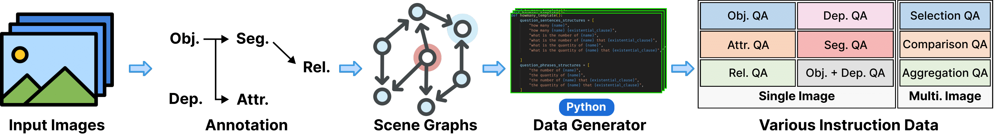

# ProVision

<p align="center">
    
<p>

If you like our project, please give us a star ⭐ on GitHub for latest update.  </h2>


## What's ProVision?

ProVision is an extendable data generation engine which produces instruction data for large multimodal language models (MLMs). 

In particular, it synthesizes instruction data via data generators (Python programs) and scene graphs rather than proprietary models.
It also includes a scene graph generation pipeline consisting of various state-of-the-art models (eg, object detection model). 
Thus, one can generate instruction data for any given image by first generating the scene graph and then apply data generators.

Provision supports generation of both single-image and multi-image instruction data.
One can also extend the engine by adding new data generators.

## Usage

For augmented scene graph generation, please follow the instruction in [SCENE_GRAPH_GENERATION.md](SCENE_GRAPH_GENERATION.md).

For instruction generation, please refer to the demo notebook in the `notebook` folder.
It contains step-by-step guide on 
1. how to generate single-image instruction data for images using ProVision's data generation engine
2. how to generate multi-image instruction data for images using ProVision's data generation engine

## ProVision-10M dataset


## Disclaimers
**ProVision** and its associated resources are provided for research and educational purposes only. 
The authors and contributors make no warranties regarding the accuracy or reliability of the data and software. 
Users are responsible for ensuring their use complies with applicable laws and regulations. 
The project is not liable for any damages or losses resulting from the use of these resources.


## Contact

- Jieyu Zhang: jieyuz2@cs.washington.edu

## Citation

**BibTeX:**

```bibtex

```

