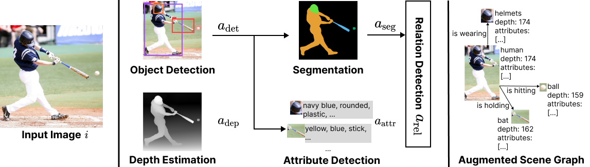

# Augmented Scene Graph Generation

This notebook includes the instructions for user to generate an augmented scene graph from an arbitrary image. Our pipeline is as follows:


**[IMPORTANT] Make sure your python environment is 3.10 and `transformers` is ready in your environment.**

## Object detection
We use [RAM](https://github.com/xinyu1205/recognize-anything/tree/main) for image tagging and [YOLO-World](https://github.com/AILab-CVC/YOLO-World/tree/master) for open vocabulary object detection.

### Requirements
1. Install RAM by
    ```bash
    pip install git+https://github.com/xinyu1205/recognize-anything.git
    ```
2. Install requirements for YOLO-World by [this instruction](https://github.com/AILab-CVC/YOLO-World/tree/master?tab=readme-ov-file#1-installation). 
3. Download the YOLO model by [this link](https://huggingface.co/wondervictor/YOLO-World/resolve/main/yolo_world_v2_l_obj365v1_goldg_pretrain_1280ft-9babe3f6.pth).
4. Specify a config file in `yolo_configs/configs/` according to [this table](https://github.com/AILab-CVC/YOLO-World/tree/master?tab=readme-ov-file#zero-shot-inference-on-lvis-dataset). As in the example, we choose `yolo_configs/configs/pretrain/yolo_world_v2_l_vlpan_bn_2e-3_100e_4x8gpus_obj365v1_goldg_train_1280ft_lvis_minival.py` as the config file.


### Usage
```python
import json
from provision.annotator import Annotator

# image_list = [list of image_path]
annotator = Annotator(device="cuda:0", image_list=image_list)
res = annotator.object_detection(
    model_path: str = "/path/to/yolo_world_v2_l_obj365v1_goldg_pretrain_1280ft-9babe3f6.pth",
    model_config_path: str = "yolo_configs/configs/pretrain/yolo_world_v2_l_vlpan_bn_2e-3_100e_4x8gpus_obj365v1_goldg_train_1280ft_lvis_minival.py",
    # Optional Configs (default values are shown as below):
    # score_thres: float = 0.05,
    # iou_thres: float = 0.5,
    # max_num_boxes: int = 100,
)
json.dump(res, open(f"{save_dir}/object-detection-annotations.json", "w"), indent=4)
```

### Return format:
```json
{
    "IMAGE_ID": {
        "data_path": "/path/to/IMAGE_ID.jpeg",
        "annotation": {
            "width": ...,
            "height": ...,
            "det_scores": [
                ...
            ],
            "labels": [
                ...
            ],
            "bboxes": [
                [
                    x_min,
                    y_min,
                    x_max,
                    y_max
                ],
                ...
            ]
        },
        "source": "DATA_SOURCE"
    },
    ...
}
```


## Image Segmentation
We use [SAM-2](https://github.com/facebookresearch/segment-anything-2?tab=readme-ov-file) for object segmentation.

### Requirements
You can install SAM2 by:
```bash
pip install 'git+https://github.com/facebookresearch/segment-anything-2.git'
```

### Usage
Image segmentation requires object detection results since we need to align these two annotations.

```python
import json
from provision.annotator import Annotator

# image_list = [list of image_path]
annotator = Annotator(device="cuda:0", image_list=image_list)
res = annotator.image_segmentation(
    save_path="/path/to/save/segmentation_file",
    obj_det_path="/path/to/object-detection-annotations.json",
    # Optional arguments:
    # multimask_output: bool,  # If true, SAM2 will output multiple mask for single bbox
    # sam2_version: str,  # This is the version from the SAM2 download URL, which is https://dl.fbaipublicfiles.com/segment_anything_2/{version}/{file_name}
    # sam2_config_path: str,  # config path for SAM2 model, also refer to: https://github.com/facebookresearch/segment-anything-2?tab=readme-ov-file#getting-started
    # save_png: bool,  # If true, segmentations will save as png files additionally into the save_path.
)
json.dump(res, open(f"{save_dir}/segmentation-annotations.json", "w"), indent=4)
```

Return format:
```json
{
    "IMAGE_ID": {
        "data_path": "/path/to/IMAGE_ID.jpeg",
        "annotation": {
            "width": ...,
            "height": ...,
            "seg_mask_id": "IMAGE_ID_mask.npy",  // [num_of_segmentations, w, h]
            "bboxes": [
                [
                    x_min,
                    y_min,
                    x_max,
                    y_max
                ],
                ...
            ],
            "labels": [
                ...
            ]
        },
        "source": "DATA_SOURCE"
    },
    ...
}
```

## Depth Estimation
We use [Depth Anything V2](https://github.com/DepthAnything/Depth-Anything-V2) for depth estimation.

### Requirement
Follow the [instruction](https://huggingface.co/docs/transformers/main/en/model_doc/depth_anything_v2) and install the necessary packages.

### Usage
```python
import json
from provision.annotator import Annotator

# image_list = [list of image_path]
annotator = Annotator(device="cuda:0", image_list=image_list)
res = annotator.depth_estimation(
    model: str = "depth-anything/Depth-Anything-V2-Large-hf",
    save_path=f"{save_dir}/depth_masks/"
)
json.dump(res, open(f"{save_dir}/depth-estimation-annotations.json", "w"), indent=4)
```

Return format:
```json
{
    "IMAGE_ID": {
        "data_path": "path/to/IMAGE_ID.jpeg",
        "annotation": {
            "width": ...,
            "height": ...,
            "depth_mask_id": "IMAGE_ID_depth.npy"  // [w, h], value from 0 to 255, the higher the object is closer.
        },
        "source": "DATA_SOURCE"
    },
}
```


## Attribute
We use a finetuned llava model for attribute detection.

### Requirement
Follow the [instruction](https://github.com/haotian-liu/LLaVA) and install the necessary packages.

### Usage
```python
import json
from provision.annotator import Annotator


# image_list = [list of image_path]
annotator = Annotator(device="cuda:0", image_list=image_list)
res = annotator.attribute_detection(
    obj_det_path: str = "/path/to/object-detection-annotations.json",
    # optional arguments:
    # model_base: str = None,
    # model_path: str = "jieyuz2/llava-v1.5-7b-attribute", # or "jieyuz2/llava-v1.5-13b-attribute" for llava-v1.5-13b
    # if_load_8bit: bool = False,
    # if_load_4bit: bool = False,
    # inp = "<image>\n{label}",
    # conv_mode = None,
    # temperature = 0.2,
    # max_new_tokens = 512
)
json.dump(res, open(f"{save_dir}/image-attributes-annotations.json", "w"), indent=4)
```

Return format:
```json
{
    "IMAGE_ID": {
        "data_path": "path/to/IMAGE_ID.jpeg",
        "annotation": {
            "annotations": [
                [list of annotations for object1],
                [list of annotations for object2],
                ...
            ]
        },
        "source": "DATA_SOURCE"
    },
}
```


## Relation
We use [Osprey](https://github.com/CircleRadon/Osprey) for relation detection. You need to download the CLIP model and specify the `clip_path` when calling `relation_detection`. Running relation detection required image segmentation results.

We have two options for relation detections: `holistic` and `detailed`.
- holistic: model will perform one-time inference and output all possible relations. Fast but may lose some accuracy.
- detailed: model will infer through all possible object pairs in the image. It takes a longer time to complete, but each object will have at least one relation with other objects.

We provide two types of APIs for relation detection. You can read the previous image segmentation results and call `annotator.relation_detection`, or perform image segmentation and relation detection simultaneously on the fly by calling `annotator.relation_wo_segment`.

You can choose to either use the original output from a model or ground the model's output into your predefined relation list.

### Requirements
1. Follow the [instruction](https://github.com/CircleRadon/Osprey?tab=readme-ov-file#install-%EF%B8%8F) and install the necessary packages.
2. Install sentence transformer:
    ```bash
    pip install -U sentence-transformers
    ```
3. Download our osprey and clip model by this [link](https://huggingface.co/datasets/jieyuz2/relation-model/resolve/main/relation_model.zip), uncompress to your specified path.
This will include the osprey model weight and the CLIP weight called `open_clip_pytorch_model.bin`.

### Usage of relation detection with predefined segmentation
```python
import json
from provision.annotator import Annotator


# image_list = [list of image_path]
annotator = Annotator(device="cuda:0", image_list=image_list)
rel_res = annotator.relation_detection(
    osprey_model_path='/path/to/osprey_model',
    clip_model_path='/path/to/clip_model',
    seg_annotation_path=f"{save_dir}/segmentation-annotations.json",
    seg_dir_path=f"{save_dir}/seg_masks"
    detection_mode = "holistic"  # or detailed
)
json.dump(rel_res, open(f"{save_dir}/relation-annotations.json", 'w'), indent=4)

grounded_res = annotator.relation_parsing(
    relation_annotation_path=f"{save_dir}/relation-annotations.json",
    category_list_path="/path/to/relations.json", # You can leave this as "" or None if you want to use the model's original output as the relation. We also provided a pre-defined relations.json.
    category_grounding=True # option of grounding your relation to your predefined relation list
)
json.dump(grounded_res, open(f"{save_dir}/relation-annotations-parsed.json", 'w'), indent=4)
```

### Usage of relation detection with on-the-fly segmentation
```python
import json
from provision.annotator import Annotator


# image_list = [list of image_path]
annotator = Annotator(device="cuda:0", image_list=image_list)
rel_res = annotator.relation_wo_segment(
    osprey_model_path='/path/to/osprey_model',
    clip_model_path='/path/to/clip_model',
    obj_det_path=f"{save_dir}/object-detection-annotations.json",
    detection_mode="holistic"
)
json.dump(rel_res, open(f"{save_dir}/relation-annotations.json", 'w'), indent=4)

grounded_res = annotator.relation_parsing(
    relation_annotation_path=f"{save_dir}/relation-annotations.json",
    category_list_path="/path/to/relations.json", # You can leave this as "" or None if you want to use the model's original output as the relation. We also provided a pre-defined relations.json.
    category_grounding=True # option of grounding your relation to your predefined relation list
)
json.dump(grounded_res, open(f"{save_dir}/relation-annotations-parsed.json", 'w'), indent=4)
```

Return format (for parsed relation):
```json
{
    "IMAGE_ID": {
        "data_path": "path/to/IMAGE_ID.jpeg",
        "annotation": {
            "width": ...,
            "height": ...,
            "relations": [
                label_id_1,  // label_id is the number according to the label sequence.
                "RELATION",
                label_id_2
            ],
        },
        "source": "DATA_SOURCE"
    },
}
```

## Scene Graph Annotation
You can use `JointDataset` to automatically combine all annotations above as a scene graph.

### Usage
```python
from provision.dataset import JointDataset


joint_dataset = JointDataset(
    [f"{save_dir}/object-detection-annotations.json", 
     f"{save_dir}/segmentation-annotations.json", 
     f"{save_dir}/depth-estimation-annotations.json",
     f"{save_dir}/image-attributes-annotations.json", 
     f"{save_dir}/relations-annotations-parsed.json"],
    seg_dir_path=f"{save_dir}/seg_masks",
    depth_dir_path=f"{save_dir}/depth_masks"
)
```
